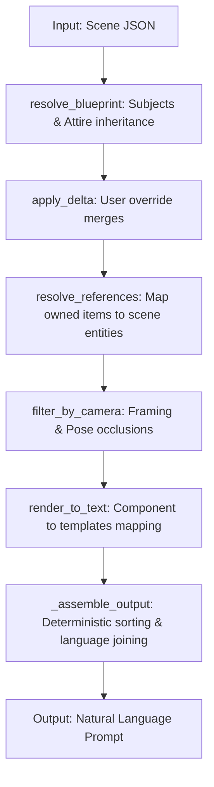

# AGENTS.md — Prompt Engine

## Quick Reference

- **Tests**: `pytest`
- **CLI**: `python compile.py <scene.json> [--profile portrait|fashion|cinematic|character_sheet] [--strict]`
- **Demo**: `python main.py`
- **Verification Gate**: `pytest` is the only verification system.

---

## Clean-Slate Architecture (V2)

The system has been completely rewritten from the legacy game-style Entity-Component-System (ECS) to a first-principles **Prototypal Inheritance Tree with a Grammar Renderer**. 

Everything lives in **`compiler.py`**. There are no custom runtime class wrappers or stateful systems; it utilizes pure pipeline functions passing raw dict state.

### The 4 Core Pipeline Layers

| Pipeline Function | Design Pattern | Responsibility |
|---|---|---|
| `resolve_blueprint` | **Layer 1: Prototypal Blueprint Store** | Merges static subject presets (`subjects.json`) and attire bundles (`attires.json`) into a flat component blueprint. |
| `apply_delta` | **Layer 2: User Override Deltas** | Merges user overrides (e.g. `Face.expression`) on top of the resolved blueprint dynamically. |
| `filter_by_camera` | **Layer 3: Camera Filter** | Filters component lists against `camera_profiles.json` and subtracts occluded zones defined in `poses.json`. |
| `render_to_text` & `_assemble_output` | **Layer 4: Grammar Catalog & Assembler** | Renders visible component properties through templates (`templates.json`), groups fragments by actor, sorts them by priority (`attribute_metadata.json`), and joins them with prepositions. |

---

## Critical Rules

1. **Camera framing gates visibility** — any visible zone must be present in the active camera profile (loaded from `data/camera_profiles.json`) and not subtracted by pose occlusions in `data/poses.json`.

2. **Override priority** — user values in `scene["objects"]` always win. The merge order resolved by the delta manager is: user scene values > attire slot settings > subject preset defaults.

3. **Database Lookups are Eager** — databases (e.g., `templates.json`, `subjects.json`, `poses.json`) are loaded eagerly during `Assembler`/`PromptCompiler` instantiation.

4. **Data-driven over hardcoded** — templates, environments, style cues, actions, and poses live in the `data/` directory. Prefer modifying JSON catalogs over writing inline Python formatting conditions.

5. **`strict=True`** — calling `compile_scene(scene, strict=True)` runs the pipeline-level `validate()` helper, raising `ValueError` on missing actors or unknown templates.

---

## Data Files (`data/`)

- `templates.json` — grammar templates for nouns (clothing, items, etc.).
- `subjects.json` — named subject blueprints with default attributes.
- `attires.json` — preset clothing bundle packages.
- `attribute_metadata.json` — priority ranks and tags (e.g. `emotion`, `clothing`) for sorting and visibility filtering.
- `render_profiles.json` — tag inclusion lists and max fragment budgets for profiles.
- `poses.json` — pose descriptions and occluded body zones.
- `environments.json` — environment configurations and fixture affordances.
- `actions.json` & `spatial_relationships.json` — relationship types and grammar variants.
- `styles.json` — style overlay and photographic mood templates.

---

## Legacy Notes (V1 ECS Architecture)
- The previous implementation used system classes (`WardrobeSystem`, `SubjectSystem`, `VisibilitySystem`, etc.) and a custom `SceneObject` class. This has been retired.
- Legacy V1 code (`compiler_legacy.py`) has been fully deleted.
